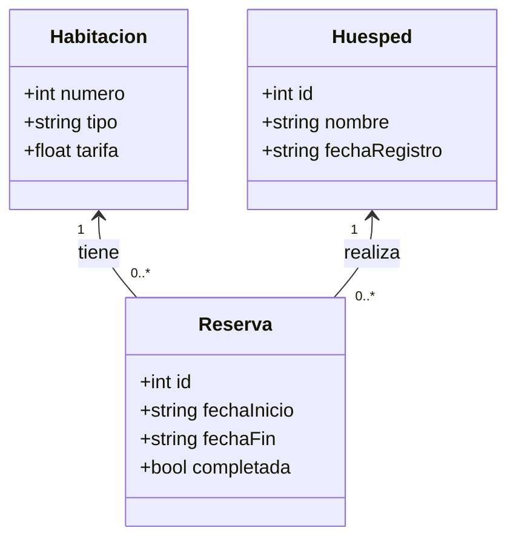

Sistema de Reservas de Hoteles

Este sistema gestiona las reservas de un hotel, incluyendo información sobre habitaciones, huéspedes y reservas.

Clases del Sistema

Habitacion  
Representa una habitación dentro del hotel con sus características principales.

- Atributos:
  - numero (int): Número único de la habitación.
  - tipo (string): Tipo de habitación (individual, doble, suite).
  - tarifa (float): Precio por noche.

Huesped  
Representa a una persona que se registra en el hotel.

- Atributos:
  - id (int): Número de identificación único.
  - nombre (string): Nombre del huésped.
  - fechaRegistro (string): Fecha en la que se registró.

Reserva  
Guarda la información de una reserva hecha por un huésped para una habitación.

- Atributos:
  - id (int): Número único de la reserva.
  - fechaInicio (string): Fecha de inicio de la reserva.
  - fechaFin (string): Fecha de finalización de la reserva.
  - completada (bool): Indica si la reserva ya finalizó (check-out realizado).

Diagrama UML en Mermaid

Relaciones con cardinalidad
    Habitacion "1" <-- "0..*" Reserva : tiene
    Huesped "1" <-- "0..*" Reserva : realiza

Por: Atala Jacob Chahin Bejarano
